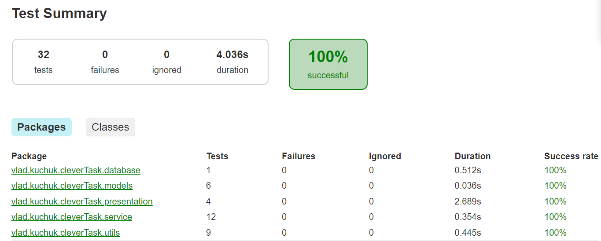

# Clever-Bank Console Application

Приложение разработано в качестве тестового задания для Clevertec

# Обзор работы консоли приложения

---

# Инструкция по запуску
Для запуска этого проекта выполните следующие шаги:

Шаг 1: Склонируйте репозиторий на свой компьютер.

Шаг 2: Создайте файл application.yml в директории `src/main/resources`. Содержимое созданного файла должно соответствовать структуре файла `application.yml.origin`. Этот шаг очень важен для корректной связи с БД, а также, корректного начисления процентов.

Шаг 3: Создайте базу данных и занесите конфигурационные данные в файл, созданный на шаге 2.

Шаг 3: Выполните скрипт databaseGeneration.sql, чтобы создать необходимые таблицы в базе данных и заполнить их данными. Этот файл находится в директории `src/main/resources`.

Шаг 4: Запустите приложение.

## Зависимости проекта

Проект использует следующие зависимости:

```gradle
dependencies {
    implementation 'org.postgresql:postgresql:42.6.0'
    compileOnly 'org.projectlombok:lombok:1.18.28'
    annotationProcessor 'org.projectlombok:lombok:1.18.28'
    implementation 'org.yaml:snakeyaml:2.1'
    compileOnly 'jakarta.servlet:jakarta.servlet-api:6.0.0'
    implementation 'com.fasterxml.jackson.core:jackson-databind:2.15.2'

    testImplementation 'org.junit.jupiter:junit-jupiter-api:5.10.0'
    testImplementation 'org.junit.jupiter:junit-jupiter-engine:5.10.0'
    testImplementation 'org.mockito:mockito-junit-jupiter:5.5.0'
}
```

---

# Описание проекта "Clever-Bank Console Application"

## Описание

Проект "Clever-Bank Console Application" представляет собой консольное приложение для управления банковской системой Clever-Bank.

## Основные сущности

1. **Банк**: В приложении представлены банки, с которыми пользователи могут взаимодействовать.

2. **Счёт**: Каждый пользователь имеет счёт в банке, на котором хранятся средства.

3. **Пользователь**: Пользователи могут создавать счета в банках и проводить операции с ними.

4. **Транзакция**: Транзакции представляют собой операции по пополнению, снятию средств со счета и переводу средств между счетами.

## Диаграмма сущностей


## Технологический стек

- **Java 17**: Язык программирования для разработки приложения.

- **Gradle**: Система сборки для управления зависимостями и сборкой проекта.

- **PostgreSQL**: Реляционная база данных для хранения информации о банках, счетах и транзакциях.

- **JDBC**: Java Database Connectivity - стандартный интерфейс для взаимодействия с базой данных из Java.

- **Lombok**: Библиотека для уменьшения количества шаблонного кода и улучшения читаемости.

- **Servlets**: Используется для создания сервлетов.

## Выполненный функционал приложения
1. **Вход в приложение**: Перед выполнением консольных операций, запрашивается войти в приложение посредством email. Аутентификация через почту сделана для упрощения входа.

2. **Операции со счетами**: Реализованы операции пополнения и снятия средств со счета.

3. **Перевод средств**: Реализована возможность перевода средств как другим клиентам Clever-Bank, так и клиентам других банков. При этом используется одна транзакция и обеспечивается безопасность для работы в многопоточной среде, предотвращая блокировки (deadlock).

4. **Начисление процентов**: Регулярно, по расписанию (раз в полминуты), производится проверка, нужно ли начислять проценты на остаток счета в конце месяца (проценты определены в конфигурационном файле `application.yml`). Проверка и начисление процентов реализованы асинхронно.


5. **Конфигурационный файл**: Значения, такие как проценты, хранятся в конфигурационном файле формата YAML (.yml). Также, этот конфигурационный файл хранит значения, необходимые для соединения с БД.

6. **Формирование чеков**: После каждой операции формируется чек и сохраняется в папку `check` в корне проекта.


7. **Тестирование**: Обеспечено покрытие юнит-тестами на уровне более 70%, включая 100% покрытие сервисного слоя.




8. **CRUD операции**: Реализованы операции CRUD (создание, чтение, обновление, удаление) для всех сущностей через сервлеты. Веб-интерфейс не предусмотрен.

9. **Нормализация базы данных**: Таблицы в базе данных соответствуют третьей нормальной форме (3 НФ).

Проект "Clever-Bank Console Application" представляет собой надежное и масштабируемое решение для управления финансами в банке Clever-Bank с использованием консольного интерфейса.

---

# Примеры CRUD операций

В этом разделе представлены примеры операций CRUD (Create, Read, Update, Delete) для каждой из сущностей: **Account**, **Bank**, **Person** и **Transaction**.

## Account (Счет)

### Создание счета (Create)

**HTTP метод**: POST

**Endpoint**: `/account?action=create`

**Пример входных данных (JSON)**:
```json
{
    "accountNumber": "1234567890",
    "personId": 1,
    "bankId": 1
}
```

**Пример выходных данных (HTTP Status Code)**: `201 Created`

### Чтение информации о счете (Read)

**HTTP метод**: GET

**Endpoint**: `/account`

**Пример запроса (HTTP URL)**: `/account?action=get&id=1`

**Пример выходных данных (JSON)**:
```json
{
    "id": 1,
    "accountNumber": "1234567890",
    "personId": 1,
    "bankId": 1
}
```

### Обновление информации о счете (Update)

**HTTP метод**: POST

**Endpoint**: `/account?action=update`

**Пример входных данных (JSON)**:
```json
{
    "accountId": 1,
    "accountNumber": "9876543210",
    "personId": 2,
    "bankId": 2
}
```

**Пример выходных данных (HTTP Status Code)**: `200 OK`

### Удаление счета (Delete)

**HTTP метод**: POST

**Endpoint**: `/account?action=delete`

**Пример входных данных (JSON)**:
```json
{
    "accountId": 1
}
```

**Пример выходных данных (HTTP Status Code)**: `200 OK`

## Bank (Банк)

### Создание банка (Create)

**HTTP метод**: POST

**Endpoint**: `/bank?action=create`

**Пример входных данных (JSON)**:
```json
{
    "name": "Clever-Bank"
}
```

**Пример выходных данных (HTTP Status Code)**: `201 Created`

### Чтение информации о банке (Read)

**HTTP метод**: GET

**Endpoint**: `/bank`

**Пример запроса (HTTP URL)**: `/bank?action=get&id=1`

**Пример выходных данных (JSON)**:
```json
{
    "id": 1,
    "name": "Clever-Bank"
}
```

### Обновление информации о банке (Update)

**HTTP метод**: POST

**Endpoint**: `/bank?action=update`

**Пример входных данных (JSON)**:
```json
{
    "id": 1,
    "name": "New Bank Name"
}
```

**Пример выходных данных (HTTP Status Code)**: `200 OK`

### Удаление банка (Delete)

**HTTP метод**: POST

**Endpoint**: `/bank?action=delete`

**Пример входных данных (JSON)**:
```json
{
    "id": 1
}
```

**Пример выходных данных (HTTP Status Code)**: `200 OK`

## Person (Человек)

### Создание человека (Create)

**HTTP метод**: POST

**Endpoint**: `/person?action=create`

**Пример входных данных (JSON)**:
```json
{
    "name": "John Doe",
    "email": "johndoe@example.com"
}
```

**Пример выходных данных (HTTP Status Code)**: `201 Created`

### Чтение информации о человеке (Read)

**HTTP метод**: GET

**Endpoint**: `/person`

**Пример запроса (HTTP URL)**: `/person?action=get&id=1`

**Пример выходных данных (JSON)**:
```json
{
    "id": 1,
    "name": "John Doe",
    "email": "johndoe@example.com"
}
```

### Обновление информации о человеке (Update)

**HTTP метод**: POST

**Endpoint**: `/person?action=update`

**Пример входных данных (JSON)**:
```json
{
    "id": 1,
    "name": "Jane Smith",
    "email": "janesmith@example.com"
}
```

**Пример выходных данных (HTTP Status Code)**: `200 OK`

### Удаление человека (Delete)

**HTTP метод**: POST

**Endpoint**: `/person?action=delete`

**Пример входных данных (JSON)**:
```json
{
    "id": 1
}
```

**Пример выходных данных (HTTP Status Code)**: `200 OK`

## Transaction (Транзакция)

### Создание транзакции (Create)

**HTTP метод**: POST

**Endpoint**: `/transaction?action=create`

**Пример входных данных (JSON)**:
```json
{
    "transaction_type": "Пополнение",
    "amount": 1000.00,
    "timestamp": "2023-08-24 14:30:00",
    "sender_account_id": 1,
    "receiver_account_id": 2
}
```

**Пример выходных данных (HTTP Status Code)**: `201 Created`

### Чтение информации о транзакции (Read)

**HTTP метод**: GET

**Endpoint**: `/transaction`

**Пример запроса (HTTP URL)**: `/transaction?action=get&id=1`

**Пример выходных данных (JSON)**:
```json
{
    "id": 1,
    "transaction_type": "Пополнение",
    "amount": 1000.00,
    "timestamp": "2023-08-24 14:30:00",
    "sender_account_id": 1,
    "receiver_account_id": 2
}
```

### Обновление информации о транзакции (Update)

**HTTP метод**: POST

**Endpoint**: `/transaction?action=update`

**Пример входных данных (JSON)**:
```json
{
    "id": 1,
    "transaction_type": "Списание",
    "amount": 500.00,
    "timestamp": "2023-08-24 15:00:00",
    "sender_account_id": 1,
    "receiver_account_id": 3
}
```

**Пример выходных данных (HTTP Status Code)**: `200 OK`

### Удаление транзакции (Delete)

**HTTP метод**: POST

**Endpoint**: `/transaction?action=delete`

**Пример входных данных (JSON)**:
```json
{
    "id": 1
}
```

**Пример выходных данных (HTTP Status Code)**: `200 OK`

---
